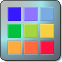

# UniColor

A Mac/iOS framework to simplify color manipulation over various Apple platforms.
It contains CGColor, NSColor, UIColor, and SwiftUI colors manipulation functions. 

## Content

### Utilities.swift

### UniColor.swift

### Palette.swift

### CGColor+Extras.swift

### Operators.swift

### Barycenter.swift
